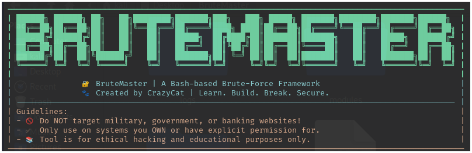

---

# 🚀 BruteMaster

**BruteMaster** is a modular Bash-based Brute-Force Framework designed for  
**educational and ethical hacking purposes**.  
Inspired by tools like Hydra and Metasploit, it provides an **interactive terminal interface** and supports modular attacks like HTTP, SSH, FTP, and PDF password brute-forcing.

> 💡 Created by **CrazyCat**  
> 📚 Learn. Build. Break. Secure.

---

## 🔰 Pre-Requisites

Ensure your system has:

```bash
sudo apt update
sudo apt install python3 python3-pip python3-venv -y
````

---

## ⚙️ Setup & Installation

### ✅ Method 1: One-Click Setup (Recommended)

```bash
git clone https://github.com/sankalpvb/BruteMaster.git
cd BruteMaster
chmod +x setup_env.sh
./setup_env.sh
```

This will:

* Create `.venv` (Python virtual environment)
* Install all required Python packages
* Launch BruteMaster interface

---

### ⚙️ Method 2: Manual Setup (Advanced)

```bash
git clone https://github.com/sankalpvb/BruteMaster.git
cd BruteMaster
python3 -m venv .venv
source .venv/bin/activate
pip install -r requirements.txt
chmod +x brutemaster.sh
./brutemaster.sh
```

> ℹ️ `brutemaster.sh` auto-activates `.venv` each time.

---

## 🎮 Terminal Interface Commands

```bash
use <module_name>        # Select a module (http, ssh, ftp, pdf)
set <option> <value>     # Set options (e.g., url, username, wordlist)
show options             # Show current module options
show modules             # List all available modules
startlog                 # Enable logging for session
stoplog                  # Disable logging
logs                     # View saved log sessions
run                      # Run selected module
exit                     # Exit BruteMaster
```

---

## 🧰 Available Modules

| Module Name | Description                   |
| ----------- | ----------------------------- |
| http        | Brute-force web login forms   |
| ssh         | Brute-force SSH credentials   |
| ftp         | Brute-force FTP login         |
| pdf         | Crack password-protected PDFs |

---

## 🧪 Example Usage

```bash
use http
set url http://localhost/login.php
set username admin
set wordlist /usr/share/wordlists/rockyou.txt
set verbose true
startlog
run
stoplog
```

```bash
use pdf
set file /path/to/encrypted.pdf
set wordlist /path/to/wordlist.txt
run
```

---

## 📜 Logging Usage

* `startlog`: Enables logging. Output is saved inside `logs/<module>/session_<timestamp>.log`
* `stoplog`: Disables logging.
* `logs`: Lists all saved log files.
* Use `tail -f logs/...` to follow logs in real-time.

> 💡 **Note:** Logs include detailed module output and are organized per module.

---

## 🛠️ Direct Module CLI Usage (Advanced)

```bash
# HTTP module
.venv/bin/python modules/http_login.py -u http://localhost/login.php -U admin -w /usr/share/wordlists/rockyou.txt --verbose

# PDF module
.venv/bin/python modules/pdf.py -f /path/to/file.pdf -w /path/to/wordlist.txt --verbose
```

---

## ❗ Troubleshooting

### 🔥 Pip `externally-managed-environment` Error?

Use virtual environment:

```bash
python3 -m venv .venv
source .venv/bin/activate
pip install -r requirements.txt
```

Or bypass with:

```bash
pip install --break-system-packages -r requirements.txt
```

---

## 👨‍💻 Author

**Sankalp Bhosale**
GitHub: [@sankalpvb](https://github.com/sankalpvb)
Inspired by real-world **Red Team** tools & offensive security research.

---

## ⚠️ Legal Disclaimer

This tool is for **educational purposes and authorized penetration testing only**.
Do **NOT** use against targets without **explicit written permission**.

---

## 📄 License

MIT License

```

